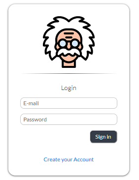
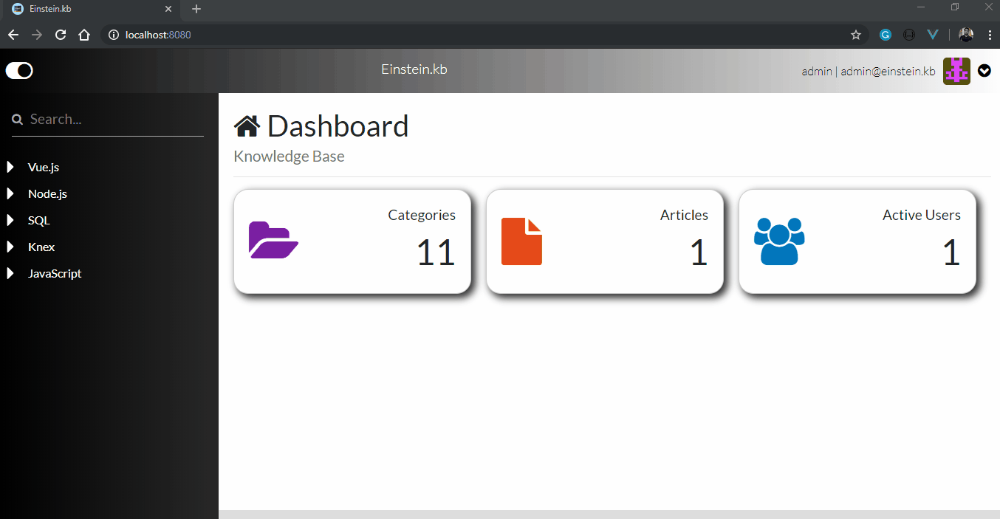

# :books: Einstein.kb - Open Source Knowledge Base Software

## Einstein.kb is an open source software to make it easier to use and administer a knowledge base, allowing you to manage users, categories, and contents
#### Please feel free to clone, download or perhaps contribute


[](https://github.com/prettier/prettier)
[](https://github.com/rminelli/backend-assessment-insurance-company/blob/master/LICENSE)

Demo site is here: [Einstein.kb](http://ec2-3-15-149-11.us-east-2.compute.amazonaws.com/)
```
User: admin@einstein.kb
Password: admin
```
Main technologies with which this project was developed:

- Node.js
- Vue.js
- PostgreSQL
- MongoDB

##

<p align="center">
  
</p>

<p align="center">
  
</p>

##

### :sparkles: :runner: Set up local Environment

**Change the environment configuration file .env, with the access credentials for the database and your preferred private key**

:heavy_exclamation_mark: _Don't forget to install and create your database locally! (PostgreSQL and MongoDB)_

```bash
# Clone this repository
$ git clone https://github.com/rminelli/einstein.kb

## Run Backend Server

# Go into the repository
$ cd backend

## Project setup
$ npm install

# Create database with knex
$ knex migrate:latest

# Run the app
$ npm start

# Run in production with pm2
$ npm run production

# The api is running at http://127.0.0.1:3800
* Use Postman a client REST to test the API.

## Run Frontend

# Go into the repository
$ cd frontend

# Project setup
$ npm install

# Compiles and hot-reloads for development
$ npm run serve

# Compiles and minifies for production
$ npm run build

# Lints and fixes files
$ npm run lint
```

## License

[MIT](https://github.com/rminelli/backend-assessment-insurance-company/blob/master/LICENSE)
